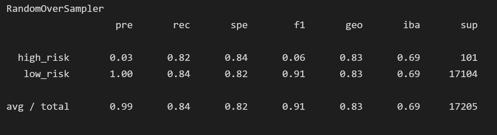
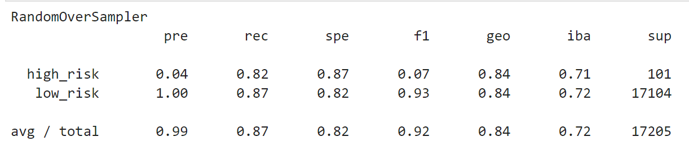
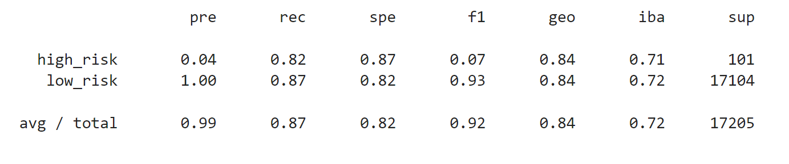
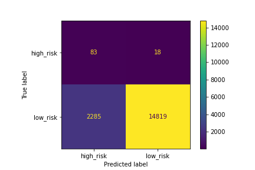
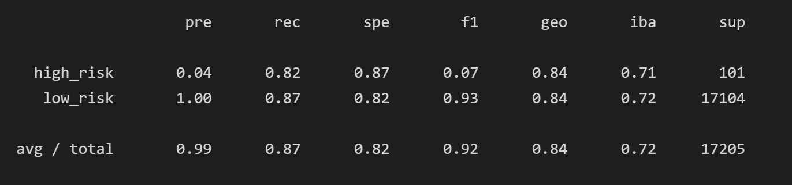
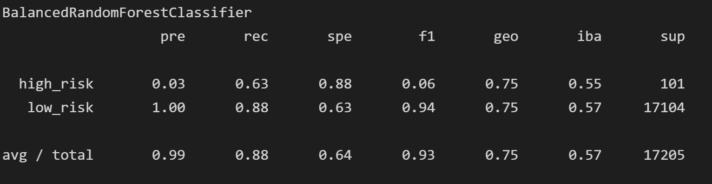
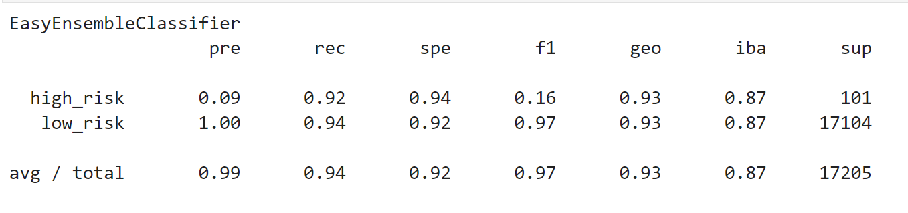

# Credit_Risk_Analysis

## Deliverables / Analysis
# Deliverable 1: Use Resampling Models to Predict Credit Risk
# Deliverable 2: Use the SMOTEENN Algorithm to Predict Credit Risk
# Deliverable 3: Use Ensemble Classifiers to Predict Credit Risk
# Deliverable 4: A Written Report on the Credit Risk Analysis (README.md)

### Deliverables 1: Use Resamplng Models to Predict Credit Risk
* For all three algorithms, the following have been completed:
- An accuracy score for the model is calculated (7.5 pt)
- A confusion matrix has been generated (7.5 pt)
- An imbalanced classification report has been generated (15 pt)

**RandomOverSampler**
- An accuracy score for the model was calculated: 0.8325
- A confusion matrix has been generated  

- An imbalanced classification report has been generated  

**SMOTE**
- An accuracy score for the model was calculated: 0.8325
- A confusion matrix has been generated  

- An imbalanced classification report has been generated  

**ClusterCentroids**
- An accuracy score for the model was calculated: 0.8325
- A confusion matrix has been generated  

- An imbalanced classification report has been generated 

### Deliverable 2: Use the SMOTEENN Algorithm to Predict Credit Risk
* The combinatorial SMOTEENN algorithm had the following:

**SMOTEENN**
- An accuracy score for the model was calculated: 0.8389
- A confusion matrix has been generated  

- An imbalanced classification report has been generated 

### Deliverable 3: Use Ensemble Classifiers to Predict Credit Risk
* The BalancedRandomForestClassifier algorithm does the following:
- An accuracy score for the model was calculated: 0.759
- A confusion matrix has been generated  

- An imbalanced classification report has been generated  

- The features are sorted in descending order by feature importance

* The EasyEnsembleClassifier algorithm does the following:
- An accuracy score for the model was calculated: 0.9319
- A confusion matrix has been generated  

- An imbalanced classification report has been generated  

- The features are sorted in descending order by feature importance